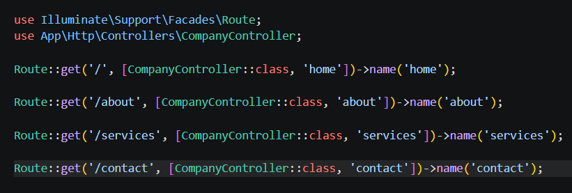
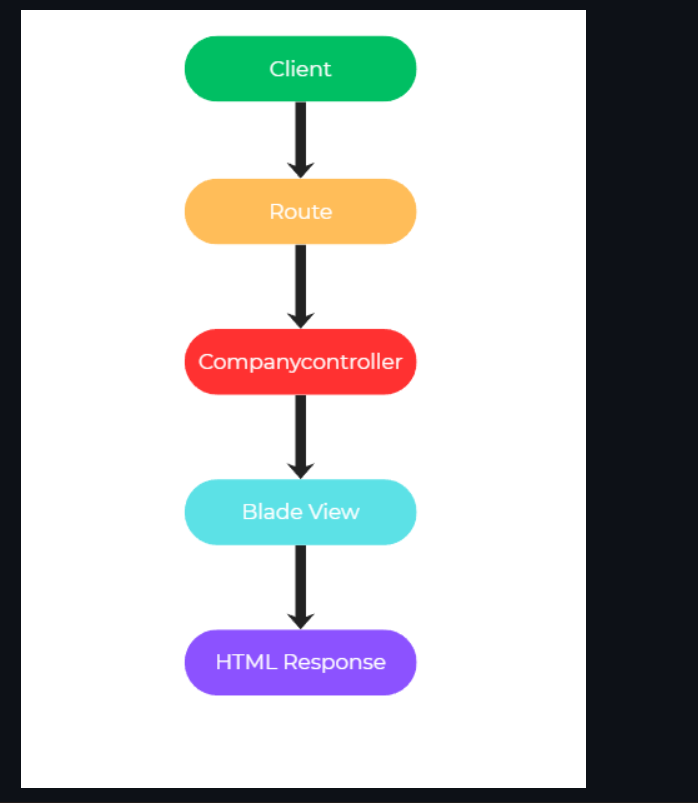
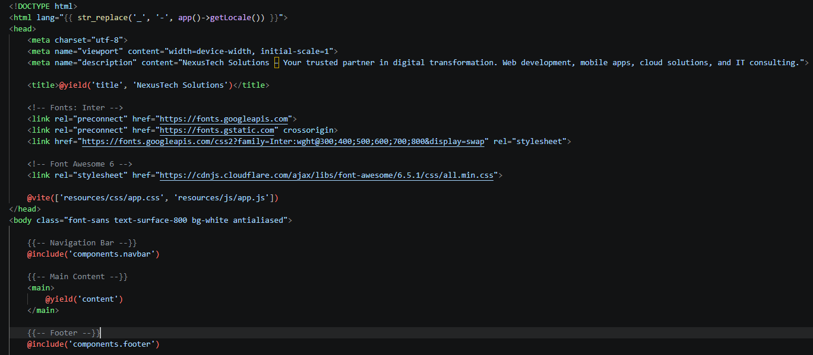
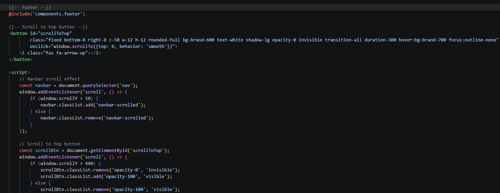
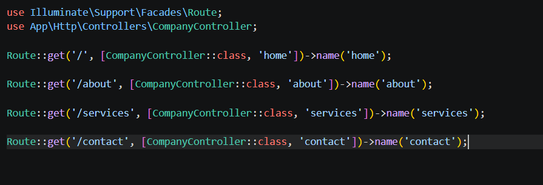

# Mini Project 02: Company Profile Website

## Project Title
**Nexora Solutions – Company Profile Website**

A responsive multi-page company profile website developed using Laravel and the Model-View-Controller (MVC) architecture. The project demonstrates Laravel routing, controllers, Blade templates, reusable components, and responsive web design.


---

## Table of Contents

1. [Project Introduction](#project-introduction)
2. [Objectives](#objectives)
3. [Technologies Used](#technologies-used)
4. [MVC Architecture](#mvc-architecture)
5. [Laravel Routing](#laravel-routing)
6. [Controllers](#controllers)
7. [Blade Templating Engine](#blade-templating-engine)
8. [Website Pages](#website-pages)
9. [Reusable Components](#reusable-components)
10. [Folder Structure](#folder-structure)
11. [Architecture Diagram](#architecture-diagram)
12. [Screenshots](#screenshots)
13. [Problems Encountered](#problems-encountered)
14. [Solutions](#solutions)
15. [Git Version Control](#git-version-control)
16. [Reflection](#reflection)
17. [References](#references)


---

## Project Introduction

Nexora Solutions is a fictional technology company created for this Laravel laboratory activity. The company profile website presents the company, its services, background, and contact information through a clean and responsive web interface.

A Company Profile Website is a website that introduces a company to its customers and visitors. It normally contains information about the company, its services, values, contact details, and other important information.

Businesses need a company website because it gives them an online presence and allows customers to easily learn about their products or services. It can also help make a business look more professional and accessible.

The purpose of this project is to create a multi-page company profile website while applying Laravel's MVC architecture. The project focuses on routing, controllers, Blade templating, reusable layouts, components, and proper organization of the Laravel application.

---

## Objectives

The main objectives of this project are:

- Understand the basic MVC architecture used by Laravel.
- Create and manage multiple Laravel routes.
- Connect routes to a controller.
- Create a `CompanyController`.
- Build multiple pages using Blade templates.
- Create a reusable Blade layout.
- Create reusable navigation and footer components.
- Apply the `@extends`, `@section`, `@yield`, and `@include` Blade directives.
- Organize the project using Laravel's folder structure.
- Create a responsive and professional company profile website.
- Practice Git version control and meaningful commits.
- Document the development process using Markdown.


---

## Technologies Used

The project was developed using the following technologies:

- **Laravel**
- **PHP**
- **Blade Templating Engine**
- **HTML5**
- **CSS3**
- **Visual Studio Code**
- **Git**
- **GitHub**
- **XAMPP**

Custom CSS was used to style the website and create the responsive layout.


## Architecture

### What is MVC?

MVC stands for **Model-View-Controller**. It is a software architecture pattern that separates an application into different parts based on their responsibilities.

### Model

The Model is responsible for handling application data and business-related operations. In this project, there is no database requirement, so the Model is not heavily used.

### View

The View is responsible for what the user sees in the browser. In this project, the Views are created using Laravel's Blade templating engine.

Examples include:

- `home.blade.php`
- `about.blade.php`
- `services.blade.php`
- `contact.blade.php`

### Controller

The Controller handles incoming requests and determines which View should be returned.

The main controller used in this project is:

`CompanyController.php`

---


### Why Laravel Uses MVC

Laravel uses MVC because it helps developers organize an application into separate responsibilities. Instead of putting routes, page design, and application logic in one place, each part has its own location.

This makes the project easier to understand, maintain, debug, and expand.

---


### Advantages of MVC in Software Development

### Better Organization

Different parts of the application are separated into Models, Views, and Controllers.

### Easier Maintenance

A developer can modify one part of the application without unnecessarily changing other parts.

### Reusable Code

Blade layouts and components can be reused across multiple pages.

### Easier Debugging

When something goes wrong, it is easier to identify whether the problem is related to the route, controller, or view.

### Scalability

The same structure can be used when the application becomes larger and more complex.

---


### Request Flow Diagram

The basic request flow of this project is:

Client / Browser
       │
       ▼
   Route (web.php)
       │
       ▼
 CompanyController
       │
       ▼
    Blade View
       │
       ▼
  HTML Response
       │
       ▼
      Browser

---

## Laravel Routing



**What is Routing?**

Routing in Laravel is the process of connecting a URL to a specific action or page. It tells Laravel what should happen when a user visits a certain URL.

In the Nexora Solutions project, the routes connect the website URLs to the appropriate methods in CompanyController.

For example, when a user visits /about, Laravel finds the matching route and calls the about() method of CompanyController.


**Named Routes**

Named routes allow routes to have a specific name that can be referenced throughout the application.

Instead of repeatedly writing the URL of a page, the route name can be used when creating links or redirects.

For example:

{{ route('home') }}

This allows the application to generate the URL associated with the route named home.

Named routes also make navigation easier to maintain because links can reference route names rather than depending directly on hard-coded URLs.


**GET Requests**

A GET request is commonly used when a user wants to retrieve or view information from a website.

Laravel provides Route::get() for defining routes that respond to HTTP GET requests.

The Nexora Solutions website uses GET routes for its four main pages:

- Home
- About
- Services
- Contact


### Route Definitions

- **Route::get() – Defines a route that responds to an HTTP GET request.
- **First argument** (`'/'`, `'/about'`, etc.) – The URL path the route matches
- **Second argument** (`[CompanyController::class, 'home']`) – An array specifying the controller class and method to call when the route is matched
- **`->name('home')`** – Assigns a named route, allowing us to reference it in Blade templates using `route('home')`

### Route Table

| HTTP Method | URL Path | Controller Method | Route Name | Description |
|-------------|----------|-------------------|------------|-------------|
| GET | `/` | `home()` | `home` | Home page |
| GET | `/about` | `about()` | `about` | About page |
| GET | `/services` | `services()` | `services` | Services page |
| GET | `/contact` | `contact()` | `contact` | Contact page |

---

## Controllers



**Purpose of Controllers**

Controllers are used to handle incoming requests and determine what response should be returned to the user.

In the Nexora Solutions project, CompanyController connects the application's routes to the corresponding Blade views.

For example, when a user visits /services, the route calls the services() method in CompanyController, which then returns the Services Blade page.

**Benefits of Controllers**

**Keeps the Code Organized** – Controllers separate application logic from the presentation of the webpage.

**Makes the project easier to understand** – Related methods can be grouped inside the same controller.

**Improves Maintainability** – If the behavior of a page needs to change, the appropriate controller method can be modified without changing the entire webpage.

**Connects different parts of Laravel** – Controllers can work with routes, models, and views.

**Connects Different Parts of Laravel** – Controllers work together with routes and views and can also work with Models in applications that use databases.

**Supports Reusable Logic** – Controller methods provide a central place for handling requests associated with different pages.

### Controller Methods

- **`CompanyController extends Controller`** – Inherits from Laravel's base Controller class, gaining access to helper methods
- **`public function home()`** – Each method is called when its corresponding route is matched
- **`return view('pages.home')`** – Returns a Blade view. The dot notation `pages.home` maps to `resources/views/pages/home.blade.php`
- **Each method returns a view** – The controller's only job is to return the appropriate view. In a real application, controllers would also fetch data from Models before passing it to views.

---

## Blade Templating Engine

**What is Blade?**

Blade is Laravel's templating engine. It allows developers to create dynamic and reusable HTML templates while keeping the presentation layer organized.

The Nexora Solutions project uses Blade templates for its different pages and reusable website components

**Blade Layouts**

Blade layouts are reusable templates that contain the common structure shared by multiple pages.

Instead of writing the complete HTML structure, navigation, and footer separately on every page, the Nexora Solutions project uses a master layout.

The layout provides a common structure for the pages and allows individual pages to insert their own content.

**Blade Components**

Blade components are reusable parts of a webpage, such as a navigation bar, button, card, or footer. They help keep the code organized because you can create the component once and use it on different pages.

**@extends** is used when a Blade page wants to use an existing layout.

**@section** is used to provide content for a section defined in the layout.

**@yield** creates a placeholder in the layout where content from a child Blade page can be inserted.

**@include** is used to insert another Blade file into the current page. It is useful for reusable sections such as a navbar or footer.


The master layout defines the overall HTML structure that all pages share:

```blade
<!DOCTYPE html>
<html lang="en">
<head>
    <meta charset="utf-8">
    <meta name="viewport" content="width=device-width, initial-scale=1">
    <title>@yield('title', 'NexusTech Solutions')</title>
    @vite(['resources/css/app.css', 'resources/js/app.js'])
</head>
<body>
    @include('components.navbar')
    <main>
        @yield('content')
    </main>
    @include('components.footer')
</body>
</html>
```






---

## Laravel Folder Structure

**Purpose of the Laravel Folders**

`app/` – Contains the main application code. This is where you usually find Controllers, Models, and other classes that handle the application's logic.

`routes/` – Contains the application's route definitions. It tells Laravel what should happen when a user visits a specific URL, such as /, /about, or /contact.

`resources/` – Contains files used to build the application's user interface, such as Blade views, CSS, and JavaScript source files. Blade pages are commonly stored in resources/views/.

`public/` – Contains files that can be directly accessed by visitors' browsers, such as images, compiled CSS/JavaScript, and other public assets. This is also where Laravel's index.php entry point is located.

`bootstrap/` – Contains files that help initialize and start the Laravel application. It also contains cached framework files generated by Laravel.

`config/` – Contains the application's configuration files. These control settings for things such as the database, mail, application environment, and other Laravel services.

---

## Screenshots

Screenshots are stored in the `screenshots/` folder. The following pages and components are documented:

| Screenshot | Description |
|------------|-------------|
| `home.png.png` | Home page with hero banner |
| `home2.png.png` | Home page about us |
| `home3.png.png` | Home page what we do |
| `home4.png.png` | Home page ready to build something great? |    
| `about.png.png` | About page our story |
| `about2.png.png` | About page our history |
| `about3.png.png` | About page our mission, vision and core values |
| `about4.png.png` | About page our team |
| `about5.png.png` | About page want to be part our story? |
| `services.png.png` | Services page our services |
| `services2.png.png` | Services page with 4 services|
| `services3.png.png` | Services page with 2 services |
| `services4.png.png` | Services page our process |
| `services5.png.png` | Services page not sure which service you need? |
| `contact.png.png` | Contact page get in touch |
| `contact2.png.png` | Contact page send us a message |
| `contact3.png.png` | Contact page find us here |
| `contact4.png.png` | Contact page FAQ |
| `navbar.png.png` | Navigation bar |
| `footer.png.png` | Footer component |
| `routes.png.png` | Route definitions |
| `controller.png.png` | CompanyController |
| `layout.png.png` | Blade layout structure |
| `layout2.png.png` | Blade layout structure 2 |
| `layout3.png.png` | Blade layout structure 3 |

---

## Problems Encountered

### 1. CSS and Asset Configuration Issues

Another challenge encountered during development involved the website styling and frontend assets.

When the CSS assets are not properly configured or compiled, the expected styling may not appear correctly in the browser.

### 2. View Not Found

Another problem encountered during development was a View not found error.

This can happen when a controller tries to return a Blade view that does not yet exist in the expected location.

### 3. Route Not Found (404 Error)

One of the challenges encountered during development was accessing pages such as /about, /services, or /contact before the required routes were properly configured.

A Laravel application will only respond to URLs that have matching routes. If a route has not been defined, Laravel cannot determine which controller method or view should handle the request.

---

## Solutions

### Summary of Challenges and Resolutions

| Problem | Root Cause | Solution |
|---------|------------|----------|
| 404 on all pages | Routes not defined | Added 4 GET routes in web.php |
| View not found | Blade file missing | Created pages/ directory with all .blade.php files |
| CSS not applied | Vite build incomplete | Ran `npm run build` to compile Tailwind CSS |
| Navbar not showing on all pages | Layout not using include | Added `@include('components.navbar')` in layout |
| Footer duplication | Code repeated in each page | Moved to components/ and included in layout |

---

## Reflection

This project helped me understand Laravel MVC in a more practical way because I was able to use the concepts while building an actual multi-page website. Before working on this project, MVC was mostly something I understood as a structure with Models, Views, and Controllers. After developing Nexora Solutions, I understood more clearly how these parts work together during a real request. I learned that the Model is mainly responsible for data, the View is responsible for the presentation, and the Controller acts as the connection between the request and the appropriate response.

One of the most important lessons I learned was the importance of separation of concerns. Instead of putting everything in one file, Laravel allows different responsibilities to be placed in their proper locations. The routes are placed in web.php, the controller methods are placed in CompanyController, and the webpage designs are placed inside the Blade views. This made the project easier to organize and understand. Reusable components also showed me why avoiding duplicated code is important. For example, the navigation bar and footer can be included in the main layout instead of being copied into every page.

I also learned how routes, controllers, and views work together. When a user visits a URL, Laravel first checks the route that matches the request. The route then points to the appropriate method in CompanyController. The controller returns the corresponding Blade view, and Laravel renders that view as HTML that can be displayed by the browser. Understanding this flow made the Laravel request lifecycle easier for me to understand.

The project also showed me how the same architecture can be applied to larger enterprise systems. Nexora Solutions is only a company profile website, so the application logic is relatively simple. In a larger system, the same MVC structure could be used with databases, Models, authentication, middleware, APIs, and more complex business logic. Controllers could receive requests and coordinate data from Models before passing that information to Views.

Overall, building Nexora Solutions improved my understanding of Laravel and gave me practical experience with MVC, routing, controllers, Blade templates, reusable components, and project organization. I also learned that having a proper structure is important because it makes an application easier to maintain and expand. This experience gives me a better foundation for developing more complex Laravel applications in future activities.

**What I Learned About MVC**

The Model-View-Controller pattern is not just about organizing files — it's a mental model for thinking about application architecture. Routes are the map of the application, defining every entry point. Controllers are the gatekeepers, deciding what data to gather and which view to render. Views are the face of the application, presenting data beautifully without worrying about where it came from. In this project, I didn't use Models since there was no database, but I can see how they would fit into the pattern — handling data retrieval, validation, and business rules independently.

**Why Separation of Concerns Matters**

The most practical lesson I learned was about maintainability. When I needed to change the navigation bar, I edited one file (`components/navbar.blade.php`) and every page updated automatically. If I had been duplicating the navbar code across four pages, I would have had to make the same change four times — and risk missing one. This separation also makes debugging easier. When a page looks wrong, I know where to look: the route, the controller, or the view. Each layer has a clear responsibility.

**How Routes, Controllers, and Views Work Together**

The request lifecycle is elegant in its simplicity. A user clicks a link, the browser sends a GET request, Laravel's router matches it to the right controller method, the controller returns a view, and the Blade engine renders it as HTML. I found Laravel's naming conventions intuitive — the route name, controller method, and view file all follow a predictable pattern that makes the code self-documenting.

**Applying This to Enterprise Systems**

The same MVC architecture that powers this four-page company profile website is the foundation of enterprise applications serving millions of users. In larger systems, Models would connect to databases, Eloquent ORM would handle complex relationships, middleware would manage authentication, and service classes would encapsulate business logic. The controller would still do what it does here — receive requests, coordinate with other components, and return responses. This scalability is what makes Laravel a serious choice for enterprise development.

Moving forward, I feel confident building more complex Laravel applications. The MVC pattern is no longer an abstract concept — it's a practical tool I've used and understood through real code.

---

## Architecture Diagram



## Linkedin Post Published
https://www.linkedin.com/feed/update/urn:li:activity:7494395640785870848/

## References

- Laravel Documentation. (n.d.). Routing. Laravel Documentation.
- Laravel Documentation. (n.d.). Controllers. Laravel Documentation.
- Laravel Documentation. (n.d.). Blade Templates. Laravel Documentation.
- Laravel Documentation. (n.d.). Request Lifecycle. Laravel Documentation.
- PHP Documentation. (n.d.). PHP Manual. PHP Documentation.
- MDN Web Docs. (n.d.). HTML, CSS, and JavaScript documentation. MDN Web Docs.
- Tailwind CSS. (n.d.). Tailwind CSS documentation. Tailwind CSS.